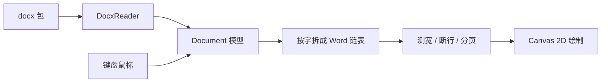

# humpk-office Word

浏览器里的 Word 文档查看与编辑器，面向 `.docx`（Office Open XML）。打开本地文件后按页排版绘制，再在画布上做有限编辑。

本仓库是作者此前用 JavaScript 写的 Word 引擎的重写：在 Cursor 里把原 JS 实现转为 TypeScript，并按一类一文件继续拆模块、补排版和编辑。模型（按字双向链表、Canvas 即时绘制）沿用旧思路，代码是新写的 TS，不是机械翻译。

当前阶段**浏览能力强于编辑**：打开常见公文、论文类 docx 后，纸张、分页、页眉页脚、表格和浮动图的观感更接近 Word。编辑与写回仍在补。不是完整的 Microsoft Word 替代品。

## 浏览

打开 `.docx` 后在浏览器里按页预览，排版尽量跟着 OOXML / Word 实现（对照 [`docs/specs`](docs/specs/README.md)）。

- **整页预览**：按节属性里的纸张尺寸、页边距分页，多页纵向铺开，可滚动查看
- **页眉页脚**：读取首页不同（`titlePg`）、奇偶页不同（`evenAndOddHeaders`），缺省时按节继承；正文顶/底按 `pgMar` 的 top/bottom 与距纸边 header/footer、页眉页脚内容高度计算
- **中文排版**：中西文混排加间隔；行尾全角标点可压缩；文档网格（`docGrid` / `snapToGrid`）约束行高；段前段后、多倍 / 最小值 / 固定行距；孤行控制
- **文字样式**：`styles.xml` 样式继承；中英文字体分流（ascii / eastAsia / hAnsi）；字号、加粗、倾斜、下划线、删除线、颜色、底纹、对齐、首行/左右缩进
- **列表编号**：读取 `numbering.xml`，显示多级编号与项目符号
- **表格**：列宽、单元格内容排版、跨行跨列合并、按行拆到下一页；表级 / 单元格边框（无显式边框时回退 Table Grid 细黑线）
- **图片**：嵌入式图片；浮动图按锚点定位，支持四周型 / 紧密型 / 穿越型 / 上下型等绕排
- **样张**：仓库 `docsample/` 可直接打开对照

浏览不做的事：PAGE 等域不按真实页码刷新；复杂 SmartArt / 公式 / 批注等未覆盖。

## 编辑

- **打开 / 新建 / 保存**：打开本地 `.docx`，新建空白文档，将**正文**导出为 `.docx`（`Ctrl/Cmd+S`）
- **正文输入**：输入、删除、撤销 / 重做，中文输入法组字
- **选区**：鼠标拖选；`Shift` + 方向键 / Home / End 扩展文字选区；表格内可矩形选格
- **格式**：Ribbon 改字体、字号、加粗 / 倾斜 / 下划线 / 删除线、颜色、底纹、对齐；表格可选框线
- **剪贴板**：剪切 / 复制 / 粘贴 / 删除（右键菜单，以及 `Ctrl/Cmd+C` / `X` / `V`）；内部剪贴板尽量保留文字样式和子表

## 原理

页面不是用 DOM / `contenteditable` 排字，而是 **一张 Canvas 按页即时绘制**。模型里存文档，排版算出每个字和每条线的坐标，绘制层用 2D Context 画出来。点选、光标、选区都对着这些坐标做命中，而不是对着 HTML 节点。

这样分页、绕排、表格跨页、页眉页脚几何可以按 Word / OOXML 自己算，不受浏览器行盒限制。输入用一层隐藏 textarea 接 IME，改的是模型，再局部重排、整帧重画。



一次绘制大致是：清屏 → 按滚动平移 → 画白纸和版心角标 → 正文行（及衬于文字后的浮动图）→ 页眉页脚 → 选区高亮 → 同步光标。字宽用同一套 Canvas `measureText` 量，避免量和画不一致。

### 故事（Story）

一份打开的文档里有多条可独立排版的故事，结构相同，都是 `Document`：

| 故事 | 作用 |
| --- | --- |
| 正文 `body` | 主文档，分页 |
| 页眉 / 页脚 | 每节可有 default / first / even 多套，画在纸张上下带 |
| 单元格 | 格子里再嵌一套 `Document`，按列宽排，不单独分页 |

选区和编辑用 `StoryRef` 标明当前在哪条故事上。

### 数据结构

持久内容（读 docx / 编辑改的）和排版结果（画布用的）分开。

**内容层**

- **`Document`**：一段故事。`paragraphs` 是段落双向链表；`words` 是拆开后的字流；`sections` 存纸张、边距、页眉页脚引用；`styles` / `numbering` 来自样式和编号部件。
- **`Paragraph`**：一段。`blocks` 对应 OOXML 的 run（一段连续同样式文字，或一张图）；表格段 `isTable`，挂 `Table`。`lines` 是排版算出来的行，不是文件里的。
- **`Block`**：一个 run。`text` + `RunStyle`（字体、字号、加粗、颜色等）；浮动/嵌入图挂 `Drawing`。
- **`Section`**：节属性。纸张宽高、页边距、`titlePg`、文档网格；以及该节的页眉页脚故事。
- **`Table` / `TableRow` / `TableCell`**：列宽、合并（`colSpan` / `rowSpan`）、边框。每个单元格自带 `document`。
- **`Drawing`**：图片尺寸、嵌入或锚点、绕排类型。排完后变成 `PlacedAnchor`（页面坐标）。

**字流与排版层**

- **`Word`**：字流上的一个节点。多数是单个字符；也可以是嵌入图、整表、分页符。带测得的 `width` / `kernedWidth` 和行内 `left`。样式从所属 `Block` 取。
- **`LinkedList` / `LinkedNode`**：段落表和字流都是双向链表。插入删除是 O(1) 改指针；光标 `CaretPos` 直接指向某个 `Word` 节点（`after` 表示在字前还是字后）。
- **`Line`**：字流上的一段切片（`startNode` + `length`），加上行高、缩进、段前段后、是否段首/段末。表格跨页时一条 table 线只覆盖部分行（`tableRowFrom` / `tableRowTo`）。
- **`PageSetup`**：当前纸张几何（CSS 像素）。正文框由 `pgMar` 的 top/bottom 与页眉页脚距纸边、内容高度算出。

打开文档时 `WordStreamBuilder` 把每个 `Block.text` **按字**拆进 `document.words`，段末补 `\n`，不改 Block 原文。`StoryLayout` 测宽、中西文间隔、断行、标点压缩、表格排版、分页、浮动图绕排，写出每条 `Line` 和每个 `Word.left`。`StoryPainter` 按行 `fillText` / `drawImage`，表格另画框线。

编辑改 `Paragraph.blocks`（或删段、插表），再把脏段落重新拆字、局部 `reflow`，最后整张 Canvas 重画。选区是 `StoryRef` + 字节点范围；表格选区是格子矩形，不跟正文范围拼在一起。

## 环境

- Node.js 20 或更高
- npm

## 安装与运行

```bash
git clone https://github.com/zhangjintao-china-123/humpk-office-word.git
cd humpk-office-word
npm install
npm run dev
```

终端会打印本地地址，一般是 `http://127.0.0.1:5173/`。若 5173 已被占用，Vite 会改用下一个端口（例如 `5174`）。用浏览器打开该地址即可。

### 其他命令

```bash
npm test          # 跑一遍单元测试
npm run test:watch
npm run build     # 类型检查并打包
```

## 怎么用

1. 点 Ribbon **打开**，选择本机 `.docx`（`docsample/` 里有样张）。先滚动看分页、页眉页脚、表格和图片。
2. 需要改字时再点进正文编辑；Ribbon 改字体、对齐、表格框线；右键做剪切 / 复制 / 粘贴。
3. 点 **保存** 或 `Ctrl/Cmd+S` 下载当前文档（目前只写回正文）。
4. 点 **新建** 得到空白文档。

常用快捷键：

| 操作 | Windows / Linux | macOS |
| --- | --- | --- |
| 撤销 / 重做 | `Ctrl+Z` / `Ctrl+Y` | `Cmd+Z` / `Cmd+Y` |
| 剪切 / 复制 / 粘贴 | `Ctrl+X` / `C` / `V` | `Cmd+X` / `C` / `V` |
| 保存 | `Ctrl+S` | `Cmd+S` |
| 加粗 / 倾斜 / 下划线 | `Ctrl+B` / `I` / `U` | `Cmd+B` / `I` / `U` |

## 当前限制

- 保存只写回正文，页眉页脚、部分表格边框等尚未完整写回
- 系统剪贴板目前带纯文本；带样式的复制粘贴主要走编辑器内部剪贴板
- 未做插删行列、单元格合并拆分、PAGE 域、双击进入页眉编辑

排版对照规范见 [`docs/specs/README.md`](docs/specs/README.md)。

## 许可

[MIT](LICENSE)
